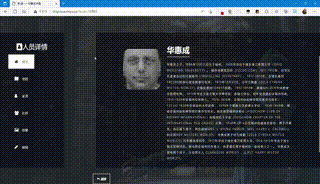

# 家·谱——智能人脸家谱系统

家·谱——智能家谱录入查询是一款基于人脸识别与图像标签的在线家谱查询录入系统，提供从人脸录入、识别到家谱构建展示的一站式服务。使用django+python+paddlehub+BaiduAPI。

支持使用paddlehub或者face_recognition两种本地库路线。

目前的功能有：

- 人脸录入、人脸识别
- 社交关系展示
- 自动家谱构建与展示
- 地图标点展示
- 家族合照分析联想

示例部署DEMO：http://124.221.104.193/

github链接：[家·谱——智能人脸家谱系统](https://github.com/KirigiriSuzumiya/familytree-paddle)





## 环境

python3.6及以上

#### windows 配置

```python
pip install django
pip install xlwt
pip install pypinpyin
pip install pyecharts
pip install paddlepaddle
pip install paddlehub
安装 Graphviz
```

#### linux 配置

```
sudo apt-get install graphviz
pip install pandas
pip install face_recognition
pip install django
pip install xlwt	
pip install pypinpyin
pip install pyecharts
pip install paddlepaddle
pip install paddlehub
```

> 因为是web服务，不保证在能AIstudio上跑通，可以到github克隆后运行

## 初始化

首先需要去百度智能开放平台申请人脸的api-key

### 1. 领取免费测试资源

前往[百度智能云-管理中心 (baidu.com)](https://console.bce.baidu.com/ai/#/ai/face/overview/resource/getFree)点击`基础服务`->`全部`免费领取人脸识别测试资源

### 2. 创建应用

前往[百度智能云-管理中心 (baidu.com)](https://console.bce.baidu.com/ai/#/ai/face/app/create)按引导创建应用，之后在应用列表中获取`api-key`和`secret-key`


### 3. 替换api-key和secret-key

在`cv/cv/codes/FaceExtractor.py` 

`cv/cv/codes/FaceRecognition.py`

`cv/cv/views.py`

这三个文件的头部有

```
# client_id 为官网获取的AK， client_secret 为官网获取的SK
api_key = "你的api_key"
secret_key = "你的secret_key"
```

将他们替换成你之前申请的api-key和secret-key。大功告成！


## 运行

```
cd cv
python manage.py runserver 0.0.0.0:80
```

**repo中的数据库已经创建了一个超级用户：用户名 `admin` 密码 `passwd`


## 功能展示与实现

#### 1. **人员录入**

作为系统的入口，通过web服务接口实现数据平台的访问，由管理人员/访客上传需要数字化的资源并经由服务端实时处理进行初步的自动化筛选。该功能一共分为三个步骤——上传相片、录入姓名、补充信息。

- 上传相片

可以在此处上传需要录入人员的照片，可以是多人合照也可以是单人照，之后系统会找出相片中的可识别人脸并进入下一步。

-  录入姓名

格式化展示从上一步所上传图片中识别出的人脸，并为每一个人脸提供一个输入框以录入姓名，提交后人脸将会被编码成128维数组并存入服务端。之后可以在人脸列表中查询与添加更多信息。

-  补充信息

这是完成录入姓名后的一个跳转页面，能够方便的跳转到人员的详情页面以编辑和补全信息并使用地图标点与自动家谱构建等功能。


#### 2. **人员识别**

上传一张相片，可以是单人或者多人合照。随后返回与已存储人人脸的比对结果，并提供详情跳转。

- 上传相片

  可以在此处上传需要识别人员的照片，可以是多人合照也可以是单人照，之后系统会找出相片中的人脸并与已录入的人脸进行比对。

- 查看结果

返回上一步识别的结果，提供识别结果详情页的跳转与识别数据的下载（包括识别结果的可视化图层叠加相片和EXCEL表格）。


#### 3. **人员列表**

为所有已经录入的人员提供一个统一查询与编辑的入口，同时提供更多详细资料的上传与展示功能。包括人员一览、人员概述、地图标点、家谱展示、图像列表、编辑信息等功能

- 人员一览

作为人员列表功能的入口，列表展示录入人员的姓名与大头照

- 人员详情页

集中提供人员概述、地图标点、家谱展示、图像列表、编辑信息等功能

- 人员概述

展示人员的大头贴及人物简述

-  地图标点

提供地图标点的展示与详情功能

-  家谱展示

根据所填资料自动生成家谱，并提供家族成员详情页面的跳转

-  图像列表

提供所有已上传人脸的展示，也可以跳转到来源图片查看合照信息。

- 编辑信息

提供所有相关信息的编辑与展示功能，包括生卒年月，家族信息，经纬度标记，概述等。


#### 4. 其他支持功能

- 用户登录注册
- 后台数据管理
- 合照重识与分析
- ……

## 部分功能代码

### 1. 人脸分割后处理

源代码位置`cv/cv/codes/FaceExtractor.py`

使用`Paddlehub`中`pyramidbox_lite_mobile`模型快速分割相片中的的人脸后分割出每一张人脸大头贴。之后将合照与大头贴分别存储进数据库。提供两种预测方式：`paddlehub`推理或者`baiduAPI`接口推理。

```python
from PIL import Image,ImageDraw,ImageFont
import glob
import os
from pathlib import Path
from dbmodel.models import FaceImage, People
from dbmodel.models import Image as image_db
import requests
import paddlehub as hub
import cv2

# client_id 为官网获取的AK， client_secret 为官网获取的SK
api_key = "你的api_key"
secret_key = "你的secret_key"

face_detector = hub.Module(name="pyramidbox_lite_mobile")

def face_locations(path):
    results = face_detector.face_detection(images=[cv2.imread(path)])
    print(results)
    locations = []
    for result in results[0]["data"]:
        locations.append([result["top"], result["right"], result["bottom"], result["left"]])
    return locations


def extractor(img_path):
    BASE_DIR = Path(__file__).resolve().parent.parent.parent
    origin = Image.open(img_path)
    locations = face_locations(img_path)
    # 保存合照人头画框
    pil_image = Image.open(img_path)
    draw = ImageDraw.Draw(pil_image)
    font_size = pil_image.size[0] // 30
    ft = ImageFont.truetype(os.path.join(BASE_DIR, 'cv', 'files', 'arialuni.ttf'), font_size)
    face_list = locations
    for i in range(len(face_list)):
        box = (face_list[i][3], face_list[i][0], face_list[i][1], face_list[i][2])
        draw.rectangle(box, None, 'yellow')
        draw.text((box[0:2]), str(i+1), "red", ft)
    img_path = os.path.join(BASE_DIR, 'cv', 'model_image', os.path.split(img_path)[-1])
    pil_image.save(img_path)
    img_path = os.path.join(BASE_DIR, 'statics', 'temp_image', os.path.split(img_path)[-1])
    image = image_db(path=os.path.split(img_path)[-1], count=len(face_list))
    image.save()
    # 保存各个人头大头贴
    count = 1
    for location in locations:
        box = (location[3], location[0], location[1], location[2])
        face = origin.crop(box)
        save_path = img_path[0:img_path.rfind('.')]+'-'+str(count)+img_path[img_path.rfind("."):]
        face.save(save_path)
        #print(save_path+" saved!")
        count += 1
    return count-1


def baidu_extractor(img_path):
    BASE_DIR = Path(__file__).resolve().parent.parent.parent
    url = 'http://124.221.104.193/static/'+img_path
    print("地址：", url)
    img_path = os.path.join(BASE_DIR, "upload",img_path)

    # 获取access_token
    host = 'https://aip.baidubce.com/oauth/2.0/token?grant_type=client_credentials&client_id=%s&client_secret=%s' % (
    api_key, secret_key)
    response = requests.get(host)
    if response:
        access_token = response.json()["access_token"]
    else:
        return 0

    # 设置请求包体
    request_url = "https://aip.baidubce.com/rest/2.0/face/v3/detect"
    request_url = request_url + "?access_token=" + access_token
    headers = {'content-type': 'application/json'}
    result = []
    params = '{"image":"%s","image_type":"URL","max_face_num":100}' % url
    response = requests.post(request_url, data=params, headers=headers)
    print(response.json())
    if response.json()["error_msg"] != "SUCCESS":
        return 0
    facelist = response.json()["result"]["face_list"]
    locations = []
    origin = Image.open(img_path)
    for face in facelist:
        locations.append(face["location"])
    # 保存合照人头画框
    pil_image = Image.open(img_path)
    draw = ImageDraw.Draw(pil_image)
    font_size = pil_image.size[0] // 30
    ft = ImageFont.truetype(os.path.join(BASE_DIR, 'cv', 'files', 'arialuni.ttf'), font_size)
    face_list = locations
    for i in range(len(face_list)):
        box = (face_list[i]["left"], face_list[i]["top"], face_list[i]["left"] + face_list[i]["width"],face_list[i]["top"] + face_list[i]["height"])
        draw.rectangle(box, None, 'yellow')
        draw.text((box[0:2]), str(i +1), "red", ft)
    img_path = os.path.join(BASE_DIR, 'cv', 'model_image', os.path.split(img_path)[-1])
    pil_image.save(img_path)
    img_path = os.path.join(BASE_DIR, 'statics', 'temp_image', os.path.split(img_path)[-1])
    image = image_db.objects.get(path=os.path.split(img_path)[-1])
    image.count = len(locations)
    image.use_baidu = True
    image.save()
    # 保存各个人头大头贴
    count = 1
    for location in locations:
        box = (location["left"], location["top"], location["left"]+location["width"], location["top"]+location["height"])
        face = origin.crop(box)
        save_path = img_path[0:img_path.rfind('.')] + '-' + str(count) + img_path[img_path.rfind("."):]
        face.save(save_path)
        # print(save_path+" saved!")
        count += 1
    return count - 1

```


### 2. 人脸比对及合照后处理

源代码位置`cv/cv/codes/FaceRecognition.py`

人脸比对功能的后端代码。先分割人脸之后再各个进行1：N的比对。为什么不进行N:M比对是为了让之后的合照重识与补录等增强功能留下可调用的接口。

```python
import base64
import shutil
import time
from io import BytesIO

import numpy as np
import os
import pandas as pd
import requests
from PIL import Image, ImageDraw, ImageFont
from ..settings import BASE_DIR
from django.shortcuts import render
from dbmodel.models import FaceImage, People
from dbmodel.models import Image as image_db
from .FaceExtractor import face_locations
from django.contrib import messages
info_dict = {}
info =""

# client_id 为官网获取的AK， client_secret 为官网获取的SK
api_key = "你的api_key"
secret_key = "你的secret_key"

def initialing():
    return
    # 载入已保存的模型
    global info_dict
    info_dict = {}
    model_saving_path = os.path.join(BASE_DIR, 'cv', 'model')
    face_objs = FaceImage.objects.all()
    for face_obj in face_objs:
        path = face_obj.path
        name = path[:path.rfind('.')]
        path = os.path.join(model_saving_path, face_obj.path)
        info = np.load(path[:path.rfind('.')]+'.npy')
        info_dict[name] = info
    return_str = ""
    for i in info_dict.keys():
        return_str += i + ','
    return return_str

def face_matchng(path,request,tolerance=1):
    img_path = path

    # 获取access_token
    global info
    info = "正在初始化"
    host = 'https://aip.baidubce.com/oauth/2.0/token?grant_type=client_credentials&client_id=%s&client_secret=%s' % (
    api_key, secret_key)
    response = requests.get(host)
    if response:
        access_token = response.json()["access_token"]
    else:
        return 0


    result = []
    info = "正在分割人脸"
    try:    # 使用百度api分割人脸
        try:
            if request.POST["use_baidu"] == "yes":
                pass
            else:
                raise "NotUsingBaidu"
        except:
            image_obj = image_db.objects.get(path=os.path.basename(img_path))
            if not image_obj.use_baidu:
                raise "NotUsingBaidu"
        url = 'http://124.221.104.193/static/upload/' + os.path.basename(img_path)
        print("地址：", url)
        # 设置请求包体
        request_url = "https://aip.baidubce.com/rest/2.0/face/v3/detect"
        request_url = request_url + "?access_token=" + access_token
        headers = {'content-type': 'application/json'}
        result = []
        params = '{"image":"%s","image_type":"URL","max_face_num":100}' % url
        response = requests.post(request_url, data=params, headers=headers)
        print(response.json())
        if response.json()["error_msg"] != "SUCCESS":
            raise "baiduExtractError"
        facelist = response.json()["result"]["face_list"]
        origin_locations = []
        locations = []
        for face in facelist:
            origin_locations.append(face["location"])
        face_list = origin_locations
        for i in range(len(face_list)):
            box = (face_list[i]["left"], face_list[i]["top"], face_list[i]["left"] + face_list[i]["width"],
                   face_list[i]["top"] + face_list[i]["height"])
            locations.append([box[1], box[2], box[3], box[0]])
        print("使用百度api分割人脸")
    except: # 使用face_recognition分割人脸
        locations = face_locations(img_path)
        print("使用本地库分割人脸")
    origin = Image.open(img_path)
    time_now = os.path.basename(img_path)[:os.path.basename(img_path).rfind('.')]
    file_type = os.path.basename(img_path)[os.path.basename(img_path).rfind('.'):]
    # 设置请求包体
    request_url = "https://aip.baidubce.com/rest/2.0/face/v3/multi-search"
    request_url = request_url + "?access_token=" + access_token
    headers = {'content-type': 'application/json'}
    try:
        image_obj = image_db.objects.get(path=os.path.basename(img_path))
        image_obj.count = len(locations)
        image_obj.save()
    except:
        pass
    # 分割人脸并一一调用百度api
    for i in range(len(locations)):
        info = "正在识别第%d个人脸，共%d个" % (i, len(locations))
        result.append([])
        box = (locations[i][3], locations[i][0], locations[i][1], locations[i][2])
        face = origin.crop(box)
        output_buffer = BytesIO()
        pic_save_path = str(time_now) + "-" + str(i+1) + img_path[img_path.rfind("."):]
        pic_save_path = os.path.join(BASE_DIR, "statics", "temp_image", pic_save_path)
        print(pic_save_path)
        face.save(pic_save_path)
        png = open(pic_save_path, 'rb')
        res = png.read()
        png.close()
        image = base64.b64encode(res).decode("ascii")
        params = '{"image":"%s","image_type":"BASE64","group_id_list":"admin","max_user_num":5,"match_threshold":%d}' % (image,int(tolerance*100))
        response = requests.post(request_url, data=params, headers=headers)
        print(response.json())
        if response.json()["error_msg"] == "SUCCESS":
            res_info = response.json()["result"]["face_list"][0]["user_list"]
            for j in range(len(res_info)):
                result[i].append({"id": res_info[j]["user_id"], "score": res_info[j]["score"]})
        else:
            result[i].append(response.json()["error_msg"])
        time.sleep(0.5)

    # 结果格式化与可视化
    info = "正在整合信息"
    recognition_result = []
    df = pd.DataFrame(result)
    df.to_excel(os.path.join(BASE_DIR, 'statics', 'temp_image', time_now+'.xls'))
    pil_image = Image.open(img_path)
    draw = ImageDraw.Draw(pil_image)
    font_size = pil_image.size[0] // 50
    ft = ImageFont.truetype(os.path.join(BASE_DIR, 'cv', 'files', 'arialuni.ttf'), font_size)
    for i in range(len(locations)):
        box = (locations[i][3], locations[i][0], locations[i][1], locations[i][2])
        draw.rectangle(box, None, 'yellow', width=font_size // 8)
        draw.text((box[0:2]), str(i+1), "red", ft)
        recognition_result.append([])
        for j in range(len(result[i])):
            if result[i][j] == "match user is not found":
                name = "未知人脸"
                recognition_result[i].append([name, 0])
            elif type(result[i][j]) == str:
                name = "人脸解析出错"
                recognition_result[i].append([name, 0])
            elif type(result[i][j]) == dict:
                try:
                    name = People.objects.filter(id=result[i][j]["id"])[0].name
                    recognition_result[i].append([name, result[i][j]["score"]])
                    if result[i][j]["score"] == 100:
                        draw.rectangle(box, None, 'lime', width=font_size // 8)
                except:
                    name = "本地库丢失id=%s" % result[i][j]["id"]
                    recognition_result[i].append([name, result[i][j]["score"]])
                    if result[i][j]["score"] == 100:
                        draw.rectangle(box, None, 'lime', width=font_size // 8)
        if recognition_result[i][0][0] == "未知人脸" or recognition_result[i][0][0] == "人脸解析出错":
            continue
        draw.text((box[0], box[1] - font_size), str(recognition_result[i][0][0]), "red", ft)
    img_path = os.path.join('temp_image', time_now + file_type)
    pil_image.save(os.path.join(BASE_DIR, 'statics', img_path))
    return_dic = {'path': img_path, 'result': recognition_result}
    return return_dic


def dict_add(path, name):
    name_path = os.path.split(path)[-1]
    img_path = name_path[:name_path.find("-")]+name_path[name_path.rfind("."):]
    try:
        image_obj = image_db.objects.filter(path=img_path)[0]
    except:
        shutil.copy(os.path.join(BASE_DIR, "upload", img_path), os.path.join(BASE_DIR, "cv", "model_image", img_path))
        image_obj = image_db(path=img_path)
        image_obj.save()
    try:
        pic_save_path = os.path.join(BASE_DIR, 'cv', 'model_image', name+'@'+name_path)
        fpw = open(pic_save_path, "wb")
        fpr = open(path, "rb")
        for line in fpr:
            fpw.write(line)
        fpw.close()
        path = os.path.basename(pic_save_path)
        name = path[:path.find('@')]
        uploadtime = pic_save_path[pic_save_path.find('@') + 1:pic_save_path.rfind('-')]
        uploadtime = time.strftime(r"%Y-%m-%d %H:%M:%S", time.localtime(eval(uploadtime)))
        print(name, uploadtime, path, "\n")
        if People.objects.filter(name=name):
            people = People.objects.filter(name=name)[0]
        else:
            people = People(name=name)
            people.save()
        obj = FaceImage(name=people, path=path, upload_time=uploadtime, image=image_obj)
        obj.save()
        # 百度api上传
        host = 'https://aip.baidubce.com/oauth/2.0/token?grant_type=client_credentials&client_id=%s&client_secret=%s' % (api_key, secret_key)
        response = requests.get(host)
        if response:
            access_token = response.json()["access_token"]
        else:
            return "token获取失败"
        request_url = "https://aip.baidubce.com/rest/2.0/face/v3/faceset/user/add"
        request_url = request_url + "?access_token=" + access_token
        headers = {'content-type': 'application/json'}
        png = open(pic_save_path, 'rb')
        res = png.read()
        png.close()
        image = base64.b64encode(res).decode("ascii")
        params = '{"image":"%s","image_type":"BASE64","group_id":"admin","user_id":"%d"}' % (image, people.id)
        headers = {'content-type': 'application/json'}
        response = requests.post(request_url, data=params, headers=headers)
        if response.json()["error_msg"] !="SUCCESS":
            return "人脸编码失败或图像已存在"
        else:
            obj.token = response.json()["result"]["face_token"]
            obj.logid = response.json()["log_id"]
            obj.save()
    except IndexError:
        print("人脸过于模糊，请提供清晰的正面照")
        return 0
    return 1
```

### 3. 家谱绘制

源代码位置`cv/cv/views.py`

这个比较麻烦，组合了familytreemaker书写dot语言再用Graphviz画图。现在的实现路径不太好，但勉强能用。

```python
def familytree(request, name):
    people_obj = People.objects.get(name=name)
    peo_obj_list = [people_obj]
    path = os.path.join(BASE_DIR, 'statics', 'temp_image', str(time.time()) + '.txt')
    fp = open(path, "w+", encoding="utf-8")
    fp.close()
    check = [people_obj]
    written = set()
    # bfs遍历
    while peo_obj_list:
        peo_now = peo_obj_list[0]
        print(peo_now)
        # 将孩子加入队列
        kids_list = peo_now.kids
        if kids_list:
            for kid in kids_list:
                try:
                    People.objects.get(name=kid)
                    if People.objects.get(name=kid) not in check:
                        peo_obj_list.insert(peo_obj_list.index(peo_now)+1, People.objects.get(name=kid))
                        check.insert(check.index(peo_now)+1, People.objects.get(name=kid))
                except:
                    pass
                finally:
                    pass

        # 将配偶加进队列
        # try:
        #     print(People.objects.get(name=peo_now.mate))
        #     if People.objects.get(name=peo_now.mate) not in check:
        #         peo_obj_list.insert(peo_obj_list.index(peo_now)+1, People.objects.get(name=peo_now.mate))
        #         check.insert(check.index(peo_now)+1, People.objects.get(name=peo_now.mate))
        # except:
        #     pass
        # 将父亲加入队列
        try:
            People.objects.get(name=peo_now.father)
            if People.objects.get(name=peo_now.father) not in check:
                peo_obj_list.insert(peo_obj_list.index(peo_now), People.objects.get(name=peo_now.father))
                check.insert(check.index(peo_now), People.objects.get(name=peo_now.father))
        except:
            pass
        finally:
            pass
        # 将母亲加入队列
        try:
            People.objects.get(name=peo_now.mother)
            if People.objects.get(name=peo_now.mother) not in check:
                peo_obj_list.insert(peo_obj_list.index(peo_now), People.objects.get(name=peo_now.mother))
                check.insert(check.index(peo_now), People.objects.get(name=peo_now.mother))
        except:
            pass
        finally:
            pass


        print(check, "\n")
        print(peo_obj_list, "\n")
        peo_obj_list.remove(peo_now)

    for peo_now in check:
        if peo_now not in written:
            couple_obj = re_familytree(peo_now, path)
            for obj in couple_obj:
                written.add(obj)
    shell = 'python ' + os.path.join(BASE_DIR, 'cv', 'codes', 'familytreemaker.py ') + path
    gra_path = path[:path.rfind('.')]
    fp = open(gra_path, 'w+', encoding="utf-8")
    p = subprocess.run(shell, stdout=subprocess.PIPE, shell=True)
    temp = p.stdout
    temp = temp.decode('cp936')

    fp.write(temp)
    fp.close()
    # os.remove(path)
    shell = "dot -Tpng " + gra_path + " -O"
    subprocess.run(shell, shell=True)
    os.remove(gra_path)
    context = {}
    context["name"] = name
    context["path"] = "temp_image/" + os.path.basename(gra_path) + ".png"
    context["check"] = list(written)
    return context


def re_familytree(people_obj, path):
    # print(people_obj)
    fp = open(path, 'a', encoding="utf-8")
    couple_obj = []
    # 为无对象父母写txt
    flag = 0
    try:
        father = People.objects.get(name=people_obj.father)
    except:
        flag=flag+1
    try:
        father = People.objects.get(name=people_obj.mother)
    except:
        flag = flag+1
    if flag == 2 and people_obj.father and people_obj.mother:
        fp.write(people_obj.mother+"(F,id=%s)\n" % "".join(lazy_pinyin(people_obj.mother)).replace(' ', '').replace(".", ''))
        fp.write(people_obj.father + "(M,id=%s)\n" % "".join(lazy_pinyin(people_obj.father)).replace(' ', '').replace(".", ''))
        fp.write("\t"+people_obj.name+"(id=%d)\n\n" % people_obj.id)
    # 为配偶写txt
    try:
        mate = People.objects.get(name=people_obj.mate)
        fp.write(mate.name + "(id=%d," % mate.id)
        if mate.sex == "female":
            fp.write("F,")
        if mate.sex == "male":
            fp.write("M,")
        if mate.birth_date:
            fp.write("birthday=%s," % str(mate.birth_date)[:-9])
        if mate.death_date:
            fp.write("deathday=%s" % str(mate.death_date)[:-9])
        fp.write(")\n")
        couple_obj.append(mate)
    except:
        mate = people_obj.mate
        if not mate:
            fp.close()
            return [people_obj]
        fp.write(mate +"(id=%s)" % "".join(lazy_pinyin(people_obj.mate)).replace(' ', '').replace(".", '') + "\n")

    # 为自己写txt
    name = people_obj.name
    fp.write(name + "(id=%d," % people_obj.id)
    if people_obj.sex == "female":
        fp.write("F,")
    if people_obj.sex == "male":
        fp.write("M,")
    if people_obj.birth_date:
        fp.write("birthday=%s," % str(people_obj.birth_date)[:-9])
    if people_obj.death_date:
        fp.write("deathday=%s" % str(people_obj.death_date)[:-9])
    fp.write(")\n")
    couple_obj.append(people_obj)

    # 为后代写txt
    kids_list = set()
    try:
        for i in People.objects.get(name=people_obj.mate).kids:
            kids_list.add(i)
    except:
        pass
    try:
        for i in people_obj.kids:
            kids_list.add(i)
    except:
        pass
    kids_list = list(kids_list)
    if kids_list:
        for i in range(len(kids_list)):
            kid = kids_list[i]
            date = ""
            try:
                kid_obj = People.objects.get(name=kid)
                date = str(kid_obj.birth_date)
            except:
                pass
            kids_list[i] = (kid, date)
    kids_list.sort(key= lambda x:x[1])
    if kids_list:
        for kid_tuple in kids_list:
            kid = kid_tuple[0]
            if not kid:
                continue
            try:
                People.objects.get(name=kid)
                fp.write("\t" + kid + "(id=%d," % People.objects.get(name=kid).id)
                if People.objects.get(name=kid).sex == "female":
                    fp.write("F,")
                if People.objects.get(name=kid).sex == "male":
                    fp.write("M,")
                if People.objects.get(name=kid).birth_date:
                    fp.write("birthday=%s," % str(People.objects.get(name=kid).birth_date)[:-9])
                if People.objects.get(name=kid).death_date:
                    fp.write("deathday=%s" % str(People.objects.get(name=kid).death_date)[:-9])
                fp.write(")\n")
            except:
                fp.write("\t" + kid +"(id=%s)" % "".join(lazy_pinyin(kid)).replace(' ', '').replace(".", '') + "\n")
    fp.write("\n")
    fp.close()
    return couple_obj
```

